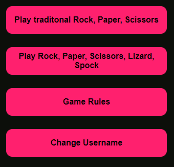
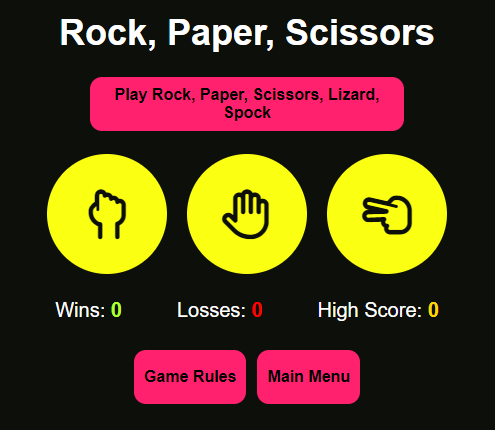

# Rock, Paper, Scissors Plus!

This website contains the traditional Rock, Paper, Scissors game along with a twist on the original. Rock, Paper, Scissors, Lizard, Spock is an evolution of the well known traditional Rock, Paper, Scissors including a higher level of chance from the additional two selections.

[Visit Rock Paper Scissors Plus](https://tomhall82.github.io/rock-paper-scissors-plus/index.html)

## Contents

- [User Experience](#user-experience-ux)

  - [Client Goals](#client-goals)
  - [First Time Visitor Goals](#first-time-visitor-goals)
  - [Returning Visitor Goals](#returning-visitor-goals)

- [Design](#design)

  - [Colour Scheme](#colour-scheme)
  - [Typography](#typography)
  - [Imagery](#imagery)

- [Features](#features)

  - [All pages](#all-pages-have)
  - [Menu](#menu-1)
  - [Traditional Rock, Paper, Scissors](#traditional-rock-paper-scissors)
  - [Rock, Paper, Scissors, Lizard, Spock](#rock-paper-scissors-lizard-spock)
  - [Rules](#game-rules)
  - [404 Page not found](#404-page-not-found)
  - [Future Implementations](#future-implementations)

- [Accessibility](#accessibility)
- [Technologies Used](#technologies-used)

  - [Languages Used](#languages-used)
  - [Libraries & Programs Used](#libraries--programs-used)

- [Deployment & Local Development](#deployment--local-development)

  - [Deployment](#deployment)
  - [How to Fork](#how-to-fork)
  - [How to Clone](#how-to-clone)

- [Testing](#testing)

  - [W3C Validator](#w3c-validator)
  - [Lighthouse](#lighthouse)
  - [Wave](#wave)
  - [Solved Bugs](#solved-bugs)
  - [Known Bugs](#known-bugs)

- [Credits]

  - [Code Used](#code-used)
  - [Content](#content)
  - [Media](#media)
    - [Menu](#menu-1)
    - [Traditional Rock, Paper, Scissors](#traditional-rock-paper-scissors-1)
    - [Rock, Paper, Scissors, Lizard, Spock](#rock-paper-scissors-lizard-spock-1)
    - [Rules](#game-rules-1)

- [Acknowledgments](#acknowledgments)

## User Experience (UX)

### Client Goals

- To be able to view the site on a variety of device sizes.
- To be able to easily navigate to the game mode of their choice.
- To be able to play the different game modes.
- To be able to input their own username.
- To be able to find the game rules.

### First Time Visitor Goals

- I want to play "Rock, Paper, Scissors".
- I want to play "Rock, Paper, Scissors, Lizard, Spock".
- I want to find the game rules.
- I want to set my username.

### Returning Visitor Goals

- I want to play my prefered game mode.
- I want to try and achieve the highest win streak possible.

## Design

### Colour Scheme

The website uses a vibrant selection of colours created using the [coolors](https://coolors.co/) website.

### Typography

Google Fonts was used for the following fonts:

- Fjalla is used for all text

### Imagery

- Icon imagery is taken from [FontAwesome](https://fontawesome.com/)

## Features

- ###### All pages have:

  - A link to each game mode.
    
    
  - A link to the main menu.
    
  - A link to the game rules.
    

- ###### Menu

  - The menu page contains links to the games and rules page.
    
  - The "Change Username" button generates an alert window which will allow the player to change their name. This window will also open on the players first visit. I have maintained the welcome message to allow for multiple players changing their names through a single session.
    
  - This page will also show the current players username, if entered. If no name is entered the username will show "Mysterious Stranger"

- ###### Traditional Rock, Paper, Scissors

  - This page contains a traditional game of Rock, Paper, Scissors.
    
  - Custom win, lose or draw message alert generated based on player username along with confirmation of computer choice.
    
  - Wins reset to 0 upon a loss, the high socre will also show the users longest winning streak whilst also counting losses.
    

- ###### Rock, Paper, Scissors, Lizard, Spock

  - This page contains a game of Rock, Paper, Scissors, Lizard, Spock.
    
  - Custom win, lose or draw message alert generated based on player username along with confirmation of computer choice.
    
  - Wins reset to 0 upon a loss, the high socre will also show the users longest winning streak whilst also counting losses.

- ###### Game Rules

  - This page contains a breakdown of the rules for each game mode.
    
  - Also included are general gameplay rules and instructions on how to change your username.
    
  - buttons to the main menu and both game modes can also be found in their relevant section on this page.

- ###### 404 Page not found

  - Website specific 404 page not found complete with link back to the main menu.
    

- ###### Future Implementations
  - Additonal game mode(s). For example "Rock, Paper, Scissors, Lizard, Spock, Spiderman, Batman, Wizard, Glock.
  - Scoreboard feature.

## Accessibility

During coding I have endeavoured to ensure that the website is as accessible friendly as possible. I have achieved this by:
Using semantic HTML.
Ensuring that there is a sufficient colour contrast throughout the site.

## Technologies Used

#### Languages Used

HTML, CSS and JavaScript were used to create this website.

#### Libraries & Programs Used

Git - For version control.

[Github](https://github.com/) - To save and store the files for the website.

[Google Fonts](https://fonts.google.com/) - To import the fonts used on the website.

[Font Awesome](https://fontawesome.com/) - For the iconography on the website.

Google Dev Tools - To troubleshoot and test features, solve issues with responsiveness and styling.

[Favicon.io](https://favicon.io/) To create favicon.

[Am I Responsive?](https://ui.dev/amiresponsive) To show the website image on a range of devices.

[W3C Validator](https://validator.w3.org/) To test HTML.

[W3C Validator (Jigsaw)](https://jigsaw.w3.org/css-validator/) To test CSS.

[Wave](https://wave.webaim.org/) To test accessibility.

## Deployment & Local Development

### Deployment

Github Pages was used to deploy the live website. The instructions to achieve this are below:

Log in (or sign up) to Github.
Find the repository for this project, rock-paper-scissors-plus.
Click on the Settings link.
Click on the Pages link in the left-hand side navigation bar.
In the Source section, choose main from the drop down select branch menu. Select Root from the drop down select folder menu.
Click Save. Your live Github Pages site is now deployed at the URL shown.
Local Development

### How to Fork

To fork the rock-paper-scissors-plus repository:

Log in (or sign up) to Github.
Go to the repository for this project, tomhall82/rock-paper-scissors-plus.
Click the Fork button in the top right corner.

### How to Clone

To clone the rock-paper-scissors-plus repository:

Log in (or sign up) to GitHub.
Go to the repository for this project, tomhall82/rock-paper-scissors-plus.
Click on the code button, select whether you would like to clone with HTTPS, SSH or GitHub CLI and copy the link shown.
Open the terminal in your code editor and change the current working directory to the location you want to use for the cloned directory.
Type 'git clone' into the terminal and then paste the link you copied in step 3. Press enter.

The live link can be found here - [https://tomhall82.github.io/rock-paper-scissors-plus/](https://tomhall82.github.io/rock-paper-scissors-plus/)

## Testing

Since deployment the site has been continually tested on iOS and android devices alongside chrome, edge and Firefox browsers.

On both mobile and tablet, the site has been tested in both portrait and landscape orientations. The desktop tests have been conducted in various size windows and dynamically to ensure responsiveness.

In addition to this, the webpage has been submitted for peer review through slack.

### [W3C Validator](https://validator.w3.org/)

### Lighthouse

##### index.html

Desktop

Mobile

##### traditional.html

Desktop

Mobile

##### plus.html

Desktop

Mobile

##### rules.html

Desktop

Mobile

### [Wave](https://wave.webaim.org/)

To test accessibility, Wave was used. All came back in a positive light except for one error found on the thank-you page which is detailed below.

##### index.html

##### traditional.html

##### plus.html

##### rules.html

##### 404.html

### Solved Bugs

1.

### Known Bugs

1. None currently.

## Credits

### Code Used

-

### Content

-

### Media

#### Menu:

-

#### Traditional Rock, Paper, Scissors:

-

#### Rock, Paper, Scissors, Lizard, Spock:

-

#### Game Rules:

-

#### 404.html

-

## Acknowledgments

- [Graeme Taylor](https://github.com/G-Taylor), my Code Institute mentor.
-
